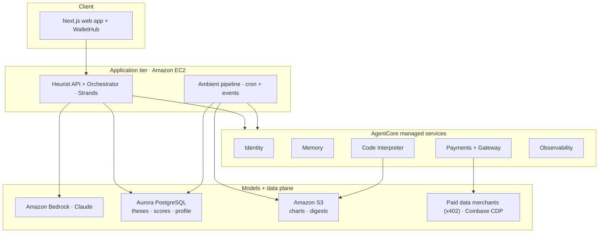
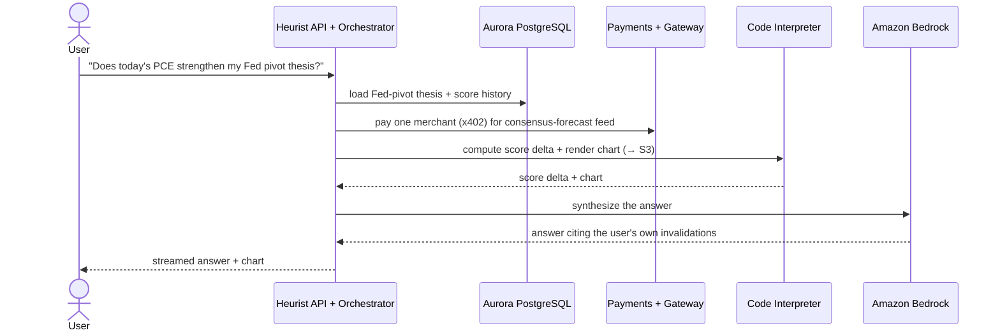

# Blog Outline — Heurist Finance × AWS AgentCore
---

## Sections

### 1. Title + opening
- Working title: **"How Heurist Finance built an AI-native investment workbench on Amazon Bedrock AgentCore"**
- Building trustworthy, end-to-end AI on premium market data is hard, and the tooling that does it well has lived behind enterprise contracts written for professional asset managers. Heurist Finance set out to put that capability in everyone's hands: one conversational AI workbench where every answer is anchored to the user's own investment theses.

### 2. TL;DR
- What Heurist Finance is. A conversational AI investment workbench that unifies research, portfolio construction, risk and stress testing, and continuous monitoring — with every answer tied to the user's own theses.
- Why AgentCore. The fully managed runtime, identity, memory, code sandbox, agent-native payments, and observability replaced months of glue code.
- Outcome headline numbers. Roughly 80% reduction in agent-platform engineering. Sub-5-second p95 chat latency. Pay-as-you-go access to 100+ premium data sources. End-to-end audit trail.

### 3. What Heurist Finance is
- Heurist Finance is a self-contained AI investment workbench. It covers what an active investor actually does, from pulling prices and reading company financials, to scanning news and social signals, running deep research, constructing portfolios, assessing risk across multiple lenses, stress testing against historical and hypothetical scenarios, and watching positions continuously. All of it runs through one AI surface, and all of it is connected back to the investor's own theses.
- What Sage is. Sage is the conversational agent inside Heurist Finance — quick chat for quick questions, deep research for the big ones. For anything compute-heavy it writes and runs Python in the Code Interpreter sandbox: correlate a company's revenue growth against its stock price, backtest a strategy across years of price history, or plot arbitrary diagrams on demand.
- A unified view of risk and return, whole-portfolio construction across asset classes, scenario analysis and stress testing, and a common data language across holdings have until now been the table stakes of enterprise investment platforms. Heurist Finance brings the same shape of capability to anyone with a question and a thesis, delivered through natural language instead of a trading desk.

### 4. The challenge — building trustworthy AI in finance
- Breadth of data needed (market, macro, fundamentals, alt-web) sits behind paywalls and bespoke APIs.
- Agents must hold funds and act on a user's behalf which needs secure runtime and key custody.
- Per-user data isolation and auditability are required to operate in retail finance.
- Engineering time on plumbing dominates time on product unless the cloud platform does the heavy lifting.

### 5. Solution at a glance
- Heurist deployed its agent system on Amazon Bedrock with AgentCore Identity, Memory, Code Interpreter, Payments, Gateway, and Observability. AWS handled the secure platform; Heurist focused on the thesis product.
- Highlight sentence: *"Every component below ladders up to a single product question: does the system know what this user believes, and is it honest about whether the market still agrees?"*

---

## Blog Body

### Pillar 1: Personalized AI investment advice

- Thesis sharpening at creation. The agent challenges fuzzy beliefs, proposes tickers, forces invalidation conditions.
- Continuous tracking. Every news item, price move, and macro print is matched against the thesis; scores decay or strengthen in real time.
- Memory. Sage remembers the user's preferences and past conversations, so it understands the user better over time.

AWS substrate:
- **Bedrock + Strands.** A team of agents research external data, and synthesize responses.
- **AgentCore Memory.** Stores user preferences and conversation history across sessions, so Sage gets to know the user.
- **Observability + OpenTelemetry.** Execution traces are pushed to Langfuse via OpenTelemetry. Metadata of every run is traced to help developers monitor the system.

Highlight: *"Sage answers as someone who already knows you — it remembers your preferences and picks up every conversation where you left it."*

### Pillar 2 — Synthesis across the data a real financial advisor needs using agent-native payments
- One turn pulls prices, macro, filings, fundamentals, and news together.
- Quant work (correlation, scenario math, charts, backtests) runs in an isolated managed sandbox.
- The agent pays for premium data *per query*, against a per-session cap without any vendor contracts.

AWS substrate:
- **Code Interpreter.** Sandboxed Python for charts, transforms, backtests. User data never leaves AWS.
- **Payments + Gateway + x402 Bazaar.** Discover paid endpoints, settle micropayments under per-session `maxSpendAmount`, never pre-pay.
- **Coinbase CDP.** Wallet keys custodied by Coinbase via PaymentConnector; Heurist never touches a private key.

Highlight: *"The agent buys the exact slice of data one user's question needs, pays for it on the spot, and stops there."*

### Pillar 3 — Ambient agents that work the market while you sleep
- One daily digest: stress flips, score strengthenings, missed-conviction prompts. The digest is the surface; the pipeline is the work.
- Behind it, a 24/7 pipeline: firehose → cluster → judge materiality → match each story to every user's preference → recompute scores → compose per-user digest.
- Cross-agent intent. Tell Sage in chat "watch the next FOMC for me" and the ambient watchers pick it up through Memory and act on it.

AWS substrate:
- **Memory (cross-agent bus).** Chat-issued intents ("track this release") are picked up by the digest and tripwire workloads.
- **Scheduled + event-driven invocation.** Stages run on cron and firehose events as first-class workloads.

Highlight: *"The user did nothing. The system was awake in the background and remembered what chat asked it to do."*

### Pillar 4 — Privacy, security, and compliance built for managing convictions (and funds)
- Theses are intimate data — beliefs, biases, horizons, eventually positions. Treated with brokerage-grade discipline.
- Isolation at every layer: Identity (OAuth flows into every call), Payments (wallet + credentials scoped per user), Memory (dialogue bound to one user), sandbox (no arbitrary egress).
- Identity is the audit join key. Every tool call, payment, and score change emits user ID + workload identity + request ID + trace ID. *"What did the agent do for user X on day Y?"* is one query.
- Guardrails on both sides. Input filters block payment/data-tool prompt injection; output filters enforce the no-unhedged-single-stock policy.
- All sensitive AgentCore state encrypted with a Heurist-managed KMS key.

AWS substrate:
- **Identity.** OAuth in, workload identity through, scoped credentials out — the audit trail is built on it.
- **Code Interpreter.** Sandboxed execution, no arbitrary network egress.
- **Bedrock Guardrails.** Input/output policy tuned for financial advice and payment-tool injection.
- **KMS customer-managed keys.** Encrypt Token Vault, Gateway, and policy-engine state at rest.
- **Coinbase CDP custody.** Signing delegated to the custodian; wallet keys never touch Heurist.

Highlight: *"Portfolios, reasoning, and wallet were each isolated by a different AWS primitive, and the audit log was the thread that proved it."*

---

### 10. Architecture diagram + request flow

#### Architecture

#### Agent Chat Flow

Highlight sentence: *"A stack of AWS managed services collaborated on one user question, and AgentCore made wiring them together a streamlined integration."*

---

### 11. Outcomes

- ~80% reduction in agent-platform engineering vs. an in-house LLM-orchestration stack (no auth, no session, no sandbox, no payments code to maintain).
- p95 chat latency: <X seconds end-to-end including paid-data calls.
- Per-user marginal cost: $Y/month inference + Z payment fees, predictable enough to price retail.
- 100% of agent decisions are reproducible from observability traces — compliance answers in one query.

### 12. What we built next on top
- Cross-thesis tension analysis surfaced in the digest (one thesis strengthening, another straining on the same signal).
- Upcoming-event tripwires — the agent watches the FRED/BEA release calendar against named invalidations and pings on the release day.
- Community-adopted theses — globally seeded macro theses with adoption signal from comparable-horizon traders.

### 13. Conclusion
- The product point — Heurist Finance proved retail traders will pay for a system that takes their convictions seriously, because nothing else does.
- The platform point — AgentCore moved the hard parts (identity, memory, sandbox, payments, observability) into managed AWS infrastructure, so a small team could ship a regulated-adjacent product without becoming a platform team.
