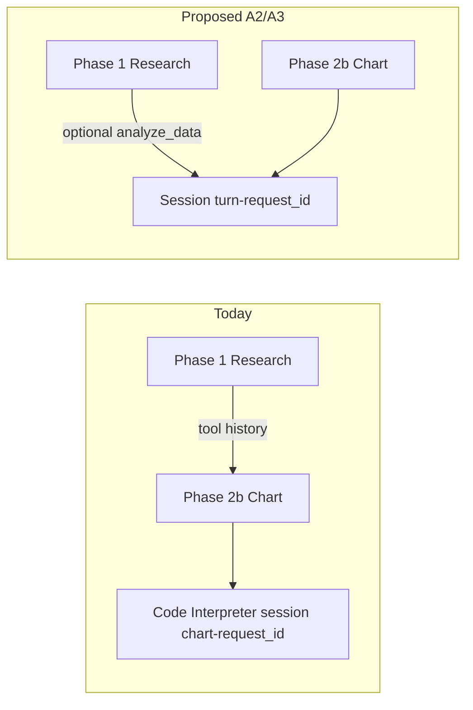
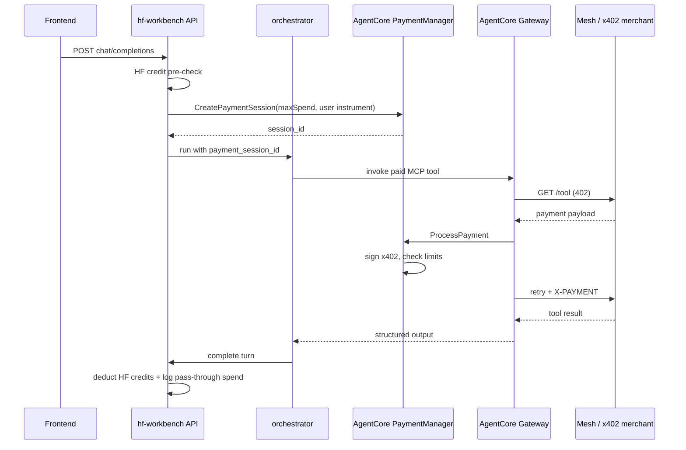
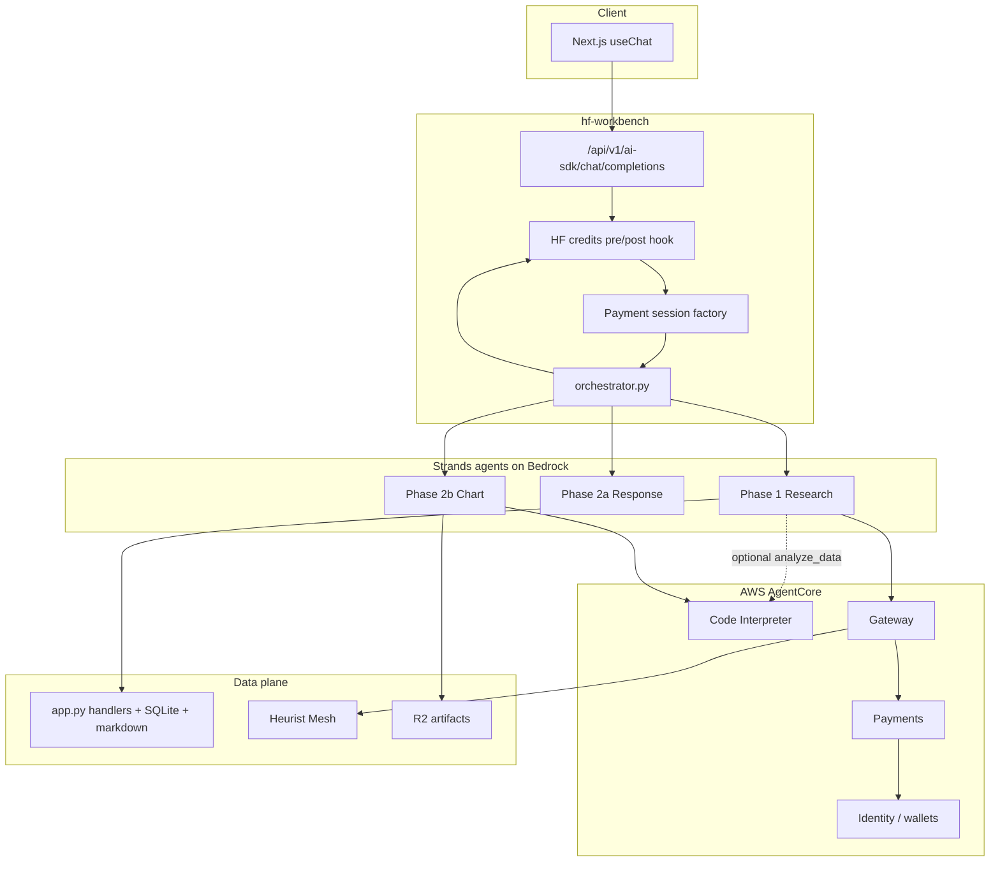

# Design: Strands + AgentCore (Code Interpreter & Payments)

**Status:** Proposal · 2026-05-21  
**Owner:** TBD  
**Related:** [`chat-agent-system.md`](chat-agent-system.md), [`design-billing-credits.md`](design-billing-credits.md), [`reviews/agent-tools-review.md`](reviews/agent-tools-review.md)

---

## Summary

hf-workbench already runs Sage chat on **AWS Strands Agents** + **Bedrock**. **AgentCore Code Interpreter** is partially integrated (chart phase only). **AgentCore payments** is not integrated yet — Mesh exposes x402-priced tools, but the research agent still calls a static, free local tool catalog.

This doc describes what we have today, what AWS AgentCore adds, and a phased plan to wire both services into the Strands pipeline without conflating two different billing layers.

---

## 1. What we have today

### 1.1 Stack

| Layer | Package / service | Role |
|---|---|---|
| Agent framework | `strands-agents>=1.0.0` | `Agent`, `@tool`, `BedrockModel`, telemetry |
| AgentCore SDK | `bedrock-agentcore` | Low-level AgentCore APIs (not yet used directly for payments) |
| Code Interpreter bridge | `strands-agents-tools[agent_core_code_interpreter]>=0.2.0` | `AgentCoreCodeInterpreter` → Strands `@tool` |
| Inference | AWS Bedrock (Claude Haiku default) | Phase 1 research, Phase 2a response, Phase 2b chart |
| Observability | Langfuse + Strands OTel (`observability.py`) | Per-request traces; no-op when keys unset |
| Usage accounting | `usage_recorder.py` → `agent_usage` SQLite | Per-phase token + cost rows |
| External data | Heurist Mesh REST (`src/clients/mesh.py`) | Yahoo, FRED, SEC, Exa — called **indirectly** via FastAPI handlers |
| Artifacts | Cloudflare R2 (`r2_storage.py`) | Chart PNG URLs in SSE stream |

Config lives in [`src/agent/config.py`](../src/agent/config.py) and [`.env.example`](../.env.example). AWS profile `payments-admin`, region `us-west-2`.

### 1.2 Turn pipeline

```
POST /api/v1/ai-sdk/chat/completions
        │
        ▼
  orchestrator.py
        │
        ├─ Phase 1: research.py ──► Strands Agent + HF tool catalog
        │         │                    (search_evidence, price_summary, …)
        │         └── tool_call_records + raw handoff text
        │
        ├─ Phase 2a: response.py ──► Strands Agent, no tools
        │         └── streamed synthesis + citation block
        │
        └─ Phase 2b: chart.py ──► Strands Agent + Code Interpreter only
                  (parallel, opt-in via enable_charts)
                  └── chart_image | chart_skip → R2
```

Each chat turn creates **fresh Strands `Agent` instances** — no cross-turn agent memory. Cancellation propagates from the SSE consumer to cancel the asyncio driver.

### 1.3 Strands usage patterns

**Phase 1 — research** ([`research.py`](../src/agent/research.py)):

- `BedrockModel` with prompt caching (`CacheConfig(strategy="auto")`, `cache_tools="default"`)
- `ConcurrentToolExecutor()` for parallel tool calls
- Tools built per-request by `build_strands_tools(user_id, mode)` — static `HF_TOOLS` tuple in [`tools.py`](../src/agent/tools.py)
- Each `@tool` calls FastAPI handlers in `app.py` as plain Python (no localhost HTTP)
- Handoff to Phase 2: truncated tool outputs + `DONE` marker semantics

**Phase 2a — response** ([`response.py`](../src/agent/response.py)):

- Separate `BedrockModel` (configurable via `RESPONSE_BEDROCK_MODEL_ID`)
- No tools; streams text deltas through the SSE queue

**Phase 2b — chart** ([`chart.py`](../src/agent/chart.py)):

- Strands agent with **one tool**: `AgentCoreCodeInterpreter(...).code_interpreter`
- Workbench **pre-bootstraps** the sandbox before the agent runs:
  1. `initSession` → `writeFiles(chart_style.py)` via [`code_interpreter.py`](../src/agent/code_interpreter.py)
  2. Agent decides PLOT vs SKIP, writes `data.json`, runs matplotlib, saves `/tmp/chart.png`
  3. Workbench fetches PNG bytes, uploads to R2, emits `data-chart` SSE part
- Failures always become `chart_skip` — never block Phase 2a

### 1.4 AgentCore Code Interpreter — current scope

Already wired, but **narrow**:

| Aspect | Today |
|---|---|
| Where | Phase 2b chart agent only |
| Session | `chart-{request_id}` per turn |
| Lifecycle | Workbench owns `initSession` + seed files; model owns `writeFiles` + `executeCode` |
| Purpose | Matplotlib charts from research tool history |
| Cost tracking | Chart phase usage dict is often empty; Code Interpreter sandbox cost not in `agent_usage` |
| Teardown | No explicit terminate — AgentCore reaps idle sessions |

The wrapper in `code_interpreter.py` mirrors the reference impl at `awsstrat/heurist_finance_agent` — JSON action payloads (`initSession`, `writeFiles`, `executeCode`, `listFiles`).

### 1.5 Mesh & x402 — current scope

[`mesh.py`](../src/clients/mesh.py) can fetch tool schemas from `MESH_METADATA_URL` (x402 agent catalog) and each `MeshTool` may carry a `price` field. **The research agent does not use this path today.** Tools are hard-coded in `HF_TOOLS`; Mesh is reached only through thin FastAPI wrappers with `HEURIST_API_KEY` auth — no per-call micropayment, no x402 negotiation.

The `tools.py` header explicitly reserves scaffolding for a future dynamic catalog ("Mesh x402") without touching agent code.

### 1.6 User billing (separate concern)

[`design-billing-credits.md`](design-billing-credits.md) defines **HF credits** — users pay for LLM inference (Stripe overage, monthly grant). That is **not** AgentCore payments. AgentCore payments is **agent → merchant** micropay (stablecoin / x402). Both layers will coexist; they must not be merged into one wallet.

---

## 2. AWS AgentCore Code Interpreter

### 2.1 What it is

[AgentCore Code Interpreter](https://docs.aws.amazon.com/bedrock-agentcore/latest/devguide/code-interpreter-tool.html) is a managed sandbox for agent-driven Python (and other languages). Key properties:

- Isolated container per session; up to 100 MB inline files, 5 GB via S3
- Pre-built runtimes (matplotlib, pandas, etc.)
- CloudTrail + AgentCore Observability
- First-class Strands integration: pass `AgentCoreCodeInterpreter(region=...).code_interpreter` as an agent tool ([AWS doc](https://docs.aws.amazon.com/bedrock-agentcore/latest/devguide/code-interpreter-using-strands.html))

**Prerequisites:** IAM role with Code Interpreter permissions, Bedrock model access, supported region (we use `us-west-2`).

### 2.2 Gap vs our current integration

We already follow the Strands pattern, but only for charts. Gaps:

1. **Single use case** — no general quantitative analysis in Phase 1 (e.g. correlation matrices, scenario math, custom aggregations on tool output).
2. **Split lifecycle** — workbench pre-inits for charts; AWS's happy path often lets the model call `initSession` itself.
3. **No cost line item** — sandbox execution time not recorded in `agent_usage`.
4. **No shared session** — chart session is isolated from research; can't reuse computed artifacts across phases without re-serializing through tool history.
5. **Chart usage telemetry** — `ChartResult.usage` is frequently `{}`.

### 2.3 Proposed Code Interpreter expansion

**Near term (A1 — telemetry + hygiene)**

- Record Code Interpreter invocations in `agent_usage` with `phase="code_interpreter"` and a flat per-session or per-execute cost estimate (once AWS publishes pricing or we derive from duration).
- Add explicit session naming convention: `{purpose}-{request_id}` (`chart-`, `analysis-`).
- Centralize session helpers in `code_interpreter.py` (already started); chart + future callers share one module.

**Medium term (A2 — research-phase analysis tool)**

- Add optional `analyze_data` Strands tool in Phase 1 that spins a **research-scoped** Code Interpreter session:
  - Input: structured JSON blob (tool outputs the model already has)
  - Output: computed summary (numbers, small tables) — **not** charts (charts stay Phase 2b)
  - Guardrails: no network fetches, no yfinance, timeout aligned with `AGENT_TIMEOUT_SECONDS`
- Keeps chart agent focused on visualization; research agent gets verifiable arithmetic.

**Later (A3 — unified sandbox per turn)**

- Single session `turn-{request_id}` shared across Phase 1 analysis snippets and Phase 2b chart (write research artifacts once, chart agent reads same `data.json`).
- Requires careful concurrency: Phase 2b runs parallel with 2a today — shared session needs a lock or "analysis completes in Phase 1 only" rule.



---

## 3. AWS AgentCore payments

### 3.1 What it is

[AgentCore payments](https://docs.aws.amazon.com/bedrock-agentcore/latest/devguide/payments.html) (preview, announced May 2026) enables agents to pay for **pay-per-use external resources** via the [x402 protocol](https://docs.aws.amazon.com/bedrock-agentcore/latest/devguide/payments-how-it-works.html) (HTTP 402 → signed stablecoin micropayment → retry with `X-PAYMENT`).

| Component | Role |
|---|---|
| **PaymentManager** | Account-level coordinator; IAM or JWT auth |
| **PaymentConnector** | Links to Coinbase CDP or Stripe Privy wallet infra |
| **Payment session** | Per-interaction budget (`maxSpendAmount`, expiry) |
| **Payment instrument** | User-funded crypto wallet; user grants agent spend permission via wallet hub |
| **ProcessPayment** | Runtime: limit check → sign → retry merchant request |
| **AgentCore Gateway** | Routes to paid MCP servers; includes Coinbase x402 Bazaar (10k+ endpoints) |

Regions (preview): us-east-1, us-west-2, eu-central-1, ap-southeast-2.

Integrates with Strands Agents per AWS docs (same SDK family we already use).

### 3.2 Why it matters for Heurist

Our Mesh catalog already exposes x402-priced agents at `MESH_METADATA_URL`. Today we bypass payment — flat `HEURIST_API_KEY` covers Mesh calls. AgentCore payments is the path to:

- **Pass-through premium data** — user wallet pays the merchant; we don't subsidize every Exa scrape / proprietary feed.
- **Dynamic tool catalog** — discover tools via Gateway/x402 Bazaar instead of maintaining `HF_TOOLS` by hand.
- **Spend governance** — session limits enforced in AgentCore infrastructure, not only in our SQLite credit check.
- **Observability** — payment traces alongside existing Langfuse agent traces.

### 3.3 Two billing layers (do not conflate)

| Layer | Who pays | Mechanism | Doc |
|---|---|---|---|
| **HF credits** | User → Heurist | Monthly grant, Stripe overage, pre-request gate | `design-billing-credits.md` |
| **AgentCore payments** | User wallet → external merchant | x402 micropay per API/MCP call | This doc |

**Mapping:** A chat turn should (a) deduct HF credits for Bedrock + our infra, and (b) optionally attach an AgentCore **payment session** whose `maxSpendAmount` is derived from the user's remaining budget or a per-turn cap. AgentCore handles merchant settlement; we record pass-through spend in `credit_ledger` or a new `agent_payments` table for transparency.

Users fund the AgentCore wallet via Coinbase WalletHub or Privy UI — **not** via our Stripe flow (different asset rail).

### 3.4 Proposed payments architecture



**Control plane (one-time setup per environment)**

1. Create `PaymentManager` (IAM authorizer, execution role).
2. Create `PaymentConnector` (Coinbase CDP or Stripe Privy) with credentials in AgentCore Identity / Secrets Manager.
3. Register Gateway targets for Mesh x402 tools we want to expose (or point at x402 Bazaar).
4. Frontend: embed Privy/Coinbase wallet hub so users fund instrument + grant agent permission.

**Data plane (per chat turn)**

1. After HF credit pre-check, create payment session scoped to `request_id` with `maxSpendAmount` from config (e.g. $0.50/turn default, overridable).
2. Pass session context into Strands tool layer — either Gateway-backed tools or Strands payment-aware tool wrapper.
3. On `ProcessPayment` success/failure, append row to observability + optional `agent_payment_events` table.
4. Close / expire session when turn completes.

### 3.5 Mesh integration options

| Option | Pros | Cons |
|---|---|---|
| **B1 — Gateway front Mesh** | AWS handles x402; unified IAM; Bazaar discoverability | Gateway setup + Mesh must expose x402-compatible endpoints |
| **B2 — Strands tools call MeshClient + AgentCore ProcessPayment** | Reuses existing `mesh.py`; incremental | We implement 402 retry ourselves; duplicates Gateway logic |
| **B3 — Hybrid** | Keep free tools local (`search_evidence`, thesis DB); route premium Mesh tools through Gateway | Two tool paths; clearest cost attribution |

**Recommendation:** **B3 hybrid** for v1. Thesis/evidence/price tools stay local (no marginal merchant cost). Premium Mesh tools (`exa_web_search`, future paid feeds) move to Gateway + payments. Static `HF_TOOLS` becomes `{local_tools} ∪ {gateway_tools(user_id, payment_session)}`.

---

## 4. Target architecture



### 4.1 New / changed modules (proposed)

| Module | Change |
|---|---|
| `src/agent/config.py` | `PAYMENT_MANAGER_ARN`, `PAYMENT_CONNECTOR_ID`, `PAYMENT_MAX_SPEND_PER_TURN`, feature flags |
| `src/agent/payments.py` | **New** — create/close payment sessions; wrap ProcessPayment |
| `src/agent/tools.py` | Split `build_local_tools()` + `build_gateway_tools(session)` |
| `src/agent/code_interpreter.py` | Shared session factory; usage hooks |
| `src/clients/mesh.py` | Optional Gateway client path; keep REST fallback |
| `src/agent/usage_recorder.py` | New phases: `code_interpreter`, `agent_payment` |
| `db/schema.py` | Optional `agent_payment_events` table |
| Frontend | Wallet funding UI (Privy template or Coinbase WalletHub redirect) |

### 4.2 IAM & env checklist

**Code Interpreter (already required for charts)**

- Bedrock model invoke
- `bedrock-agentcore:InvokeCodeInterpreter` (exact action names per AWS IAM doc for your role)
- Region `us-west-2`

**Payments (new)**

- PaymentManager / PaymentConnector control-plane APIs
- Data-plane: `CreatePaymentSession`, `ProcessPayment`, `GetResourcePaymentToken` via AgentCore Identity
- Gateway invoke permissions for registered targets
- Secrets Manager read for connector credentials (via Identity)

See [payments IAM roles](https://docs.aws.amazon.com/bedrock-agentcore/latest/devguide/payments-iam-roles.html) and [Code Interpreter prerequisites](https://docs.aws.amazon.com/bedrock-agentcore/latest/devguide/code-interpreter-getting-started.html#code-interpreter-prerequisites).

### 4.3 Observability

| Signal | Source | Today | Target |
|---|---|---|---|
| LLM tokens / cost | Strands → `agent_usage` | ✅ | Keep |
| Traces | Langfuse + Strands OTel | ✅ | Keep |
| Code Interpreter runs | Strands/agent layer | ✅ | `code_interpreter_runs` table + chart token cost in `agent_usage` + Langfuse span + OTel metrics (2026-05-25). AgentCore-native CloudWatch/X-Ray still not pulled. See `agent-observability.md`. |
| x402 payments | AgentCore Observability | ❌ | `agent_payment_events` + link to Langfuse span |

---

## 5. Phased rollout

### Phase 0 — Review complete (this doc)

Inventory current Strands + partial Code Interpreter integration; align on two billing layers; pick hybrid Mesh path.

### Phase A — Code Interpreter hardening

| Step | Work |
|---|---|
| A.0 | Confirm IAM + smoke: `scripts/smoke_chart_agent.py` green in `us-west-2` |
| A.1 | Log Code Interpreter actions (init/execute counts) into `agent_usage` |
| A.2 | Fix `ChartResult.usage` propagation from Strands metrics |
| A.3 | Spike: `analyze_data` tool in Phase 1 behind `enable_analysis` flag |

**Exit criteria:** Chart smokes pass; usage rows include chart/code_interpreter phases; no regression in `hf-evals` chat scenarios.

### Phase B — AgentCore payments foundation

| Step | Work |
|---|---|
| B.0 | AWS preview access + create PaymentManager + Connector (staging) |
| B.1 | `src/agent/payments.py` — session create/close; unit tests with mocked boto3 |
| B.2 | Frontend wallet hub spike (Privy AgentCore SDK template) |
| B.3 | `agent_payment_events` schema + admin query script |

**Exit criteria:** User can fund wallet and grant agent; session creates with limit; dry-run ProcessPayment in staging.

### Phase C — Paid Mesh tools via Gateway

| Step | Work |
|---|---|
| C.0 | Register one paid Mesh tool in Gateway (e.g. `exa_web_search`) |
| C.1 | Dynamic tool builder merges local + gateway tools when `payment_session` active |
| C.2 | Map pass-through spend into HF credit ledger (markup TBD) |
| C.3 | `hf-evals` scenario: paid tool invoked within budget; over-limit denied |

**Exit criteria:** Research agent calls a paid Mesh tool end-to-end; user sees itemized pass-through in billing API.

### Phase D — Unified sandbox (optional)

| Step | Work |
|---|---|
| D.0 | Design lock: shared `turn-{request_id}` session vs parallel chart |
| D.1 | Implement if chart latency acceptable with shared session |

---

## 6. Risks & open questions

1. **Preview instability** — AgentCore payments APIs may change before GA. Isolate behind feature flags; avoid hard dependency in critical path until GA.
2. **Double billing UX** — Users may not understand HF credits vs wallet top-up. Product copy must separate "AI chat budget" from "premium data wallet."
3. **Stablecoin / compliance** — x402 uses USDC; geographic and regulatory constraints on Coinbase/Privy onramps. May limit rollout regions.
4. **Mesh x402 parity** — Confirm Mesh merchants return proper 402 payloads compatible with AgentCore Gateway, or plan B2 fallback.
5. **Cost of Code Interpreter** — Pricing model for sandbox time may differ from Bedrock tokens; need AWS list price before tying to HF credits.
6. **Session concurrency** — Shared sandbox (Phase D) vs parallel chart/response needs profiling.
7. **Relationship to HF credits markup** — Should pass-through x402 spend carry the same 1.5× markup as inference (`HF_CREDIT_MARKUP`)? Product decision.

---

## 7. References

- [AgentCore Code Interpreter dev guide](https://docs.aws.amazon.com/bedrock-agentcore/latest/devguide/code-interpreter-tool.html)
- [Code Interpreter + Strands](https://docs.aws.amazon.com/bedrock-agentcore/latest/devguide/code-interpreter-using-strands.html)
- [AgentCore payments overview](https://docs.aws.amazon.com/bedrock-agentcore/latest/devguide/payments.html)
- [How AgentCore payments works](https://docs.aws.amazon.com/bedrock-agentcore/latest/devguide/payments-how-it-works.html)
- [AgentCore payments preview announcement (May 2026)](https://aws.amazon.com/about-aws/whats-new/2026/04/amazon-bedrock-agentcore-payments-preview/)
- [Privy AgentCore SDK (wallet hub template)](https://github.com/privy-io/aws-agentcore-sdk)
- Internal: [`docs/chat-agent-system.md`](chat-agent-system.md), [`src/agent/AGENTS.md`](../src/agent/AGENTS.md)
